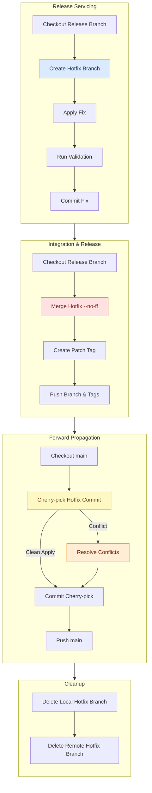
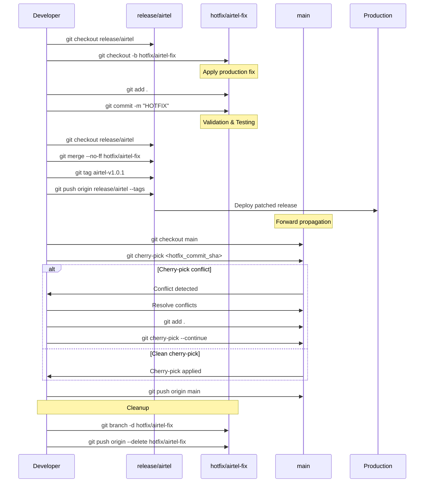

# Agent guide

This file acts as a guide in helping the agent understand branch topology, hotfix rules, cherry-pick and merge expectations, release history conventions and other safety policies so that the agent can then recommend safe git operations, generate command sequences, provide hotfix suggestions, detect risky merges, suggest cherry fixes and have traceback accouuntability.

## Repository Layout

```text
main
│
├── release/airtel
│   └── hotfix/airtel-readme-fix
│
├── release/reliance
│
└── release/tata
```

## Repository Topology

### Branches

| Pattern | Example | Purpose |
|---|---|---|
| `main` | `main` | ongoing future development |
| `develop` | `develop` | integration branch for upcoming releases |
| `release/<customer>` | `release/airtel` | customer production servicing branch |
| `release/<version>` | `release/v2.1` | shared release stabilization branch |
| `hotfix/<customer>-<issue>` | `hotfix/airtel-auth-fix` | customer-specific production hotfix |
| `hotfix/<severity>-<issue>` | `hotfix/p1-login-outage` | severity-based production fix |
| `feature/<feature-name>` | `feature/branch-visualization` | new functionality development |

### Rules

- `main` is unstable and contains future work
- release branches contain customer-stable code
- customer branches are isolated
- fixes are propagated via cherry-pick
- direct merges from `main` into release branches are prohibited

### Naming rules

- branch names must use lowercase
- words must be separated with hyphens
- customer release branches must begin with `release/`
- production fixes must begin with `hotfix/`
- hotfix branch names should describe the production issue
- release branches are long-lived
- hotfix branches are temporary and might be deleted after merge
- direct commits to release branches are prohibited

---

## Release Strategy

### Tags

Format:

<customer>-v<major>.<minor>.<patch>

Examples:

- airtel-v1.0.0
- airtel-v1.0.1
- reliance-v1.0.0

### Patch Rules

- patch increments represent hotfix releases
- tags represent production deployment states
- release branches must always be taggable

### Customer Isolation

Customer release branches may contain:
- customer-specific configs
- feature flags
- branding assets
- deployment manifests

Agents must assume customer branches are not interchangeable.
Cross-customer cherry-picks require compatibility validation.

### Hotfix Policy

- all production fixes originate from hotfix branches
- hotfix branches must branch from release branches
- hotfix merges must use --no-ff
- hotfixes must be propagated back to main
- customer hotfixes are isolated unless explicitly shared

### Hotfix flow



### Sequence diagram



---

## Cherry pick rules

### Allowed Flows

| Source | Destination | Allowed |
|---|---|---|
| release/* | main | yes |
| main | release/* | yes |
| release/customerA | release/customerB | restricted |

### Rules

- cherry-pick is preferred over merge for servicing
- only validated commits may be cherry-picked into release branches
- merge from main into release branches is prohibited
- cherry-pick conflicts must be manually resolved
- if fix only exists in release then cherry-pick to main
- if fix needed across customers then cherry-pick acrosss release branches
- do not propogate customer specific config changes

### Conflict Resolution

### Common Conflict Areas

- README.md
- environment configuration
- customer-specific assets

### Conflict Markers
```
<<<<<<< HEAD
=======
>>>>>>>
```

### Resolution Process

1. inspect both changes
2. preserve customer-specific configuration
3. remove conflict markers
4. git add resolved files
5. git cherry-pick --continue

---

## Git primitives to be used

### Create Hotfix
```bash
git checkout release/airtel
git pull origin release/airtel

git checkout -b hotfix/airtel-auth-fix
```

### Complete Hotfix
```bash
git add .
git commit -m "HOTFIX: fix auth issue"

git checkout release/airtel
git merge --no-ff hotfix/airtel-auth-fix

git tag airtel-v1.0.1

git push origin release/airtel --tags
```

### Propagate Fix To Main
```bash
git checkout main
git pull origin main

git cherry-pick -x <commit_sha>

git push origin main
```

### Propagate Fix To Another Release Branch
```bash
git checkout release/reliance
git pull origin release/reliance

git cherry-pick -x <commit_sha>

git push origin release/reliance
```

### Resolve Cherry-Pick Conflict
```bash
git status

git diff --name-only --diff-filter=U

# manually resolve conflicts

git add .

git cherry-pick --continue
```

### Abort Failed Cherry-Pick
```bash
git cherry-pick --abort
```

### Abort Failed Merge
```bash
git merge --abort
```

### Abort Failed Rebase
```bash
git rebase --abort
```

### Validate Current Branch State
```bash
git status

git branch -vv

git remote -v
```

### Inspect Hotfix Commit
```bash
git show <commit_sha>
```

### Inspect Tag Details
```bash
git show <tag>
```

### Compare Branch Divergence
```bash
git log release/airtel..main

git log main..release/airtel
```

### Detect Missing Cherry-Picks
```bash
git cherry -v release/airtel main
```

### Cleanup Local Hotfix Branch
```bash
git branch -d hotfix/airtel-auth-fix
```

### Cleanup Remote Hotfix Branch
```bash
git push origin --delete hotfix/airtel-auth-fix
```

### Remove Stale Remote References
```bash
git fetch --prune
```

---

## Repository history and diagnostics

### Visualize Branch Graph
```bash
git log --graph --decorate --oneline --all
```

### Visualize Detailed Commit History
```bash
git log --oneline --decorate --graph
```

### Check Branch Containing Commit
```bash
git branch --contains <sha>
```

### Inspect Commit Details
```bash
git show <sha>
```

### View Tags
```bash
git tag
```

### View Latest Tags
```bash
git tag --sort=-creatordate
```

### Resolve Merge State
```bash
git status
```

### Identify Conflicted Files
```bash
git diff --name-only --diff-filter=U
```

### View Current Differences
```bash
git diff
```

### Check Tracking Branch Information
```bash
git branch -vv
```

### Inspect Remote Configuration
```bash
git remote -v
```

### Verify Release Branch Drift
```bash
git log release/airtel..main

git log main..release/airtel
```

### Detect Already-Applied Commits
```bash
git cherry -v release/airtel main
```

### View Merged Branches
```bash
git branch --merged
```
---

## Recovery Rules

If cherry-pick fails:
- inspect conflicted files
- preserve customer-specific configuration
- never auto-resolve production config conflicts
- use git cherry-pick --abort if validation fails

If merge state is corrupted:
- use git merge --abort
- never reset shared release branches without approval

---

## Safety Constraints

- never merge main directly into release branches
- never force-push release branches
- never delete production tags
- release branches must remain deployable
- all hotfixes require tags
- cherry-picks into release branches require validation

## Validation Requirements

Before merging hotfixes:

- unit tests must pass
- customer-specific smoke tests must pass
- deployment manifest must validate
- branch must be rebased with latest release branch
- no unresolved conflict markers allowed

---

## Agent Restrictions

Agents must never:
- execute git push --force on protected branches
- delete release branches
- auto-resolve customer configuration conflicts
- auto-tag releases without validation
- rewrite published history
- merge unrelated release branches
